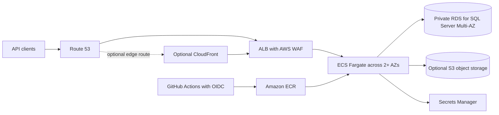

# AWS Healthcare API Platform

A production-minded reference design and staged implementation plan for a containerized .NET API on AWS. It covers multi-AZ networking, private application and database tiers, Terraform, secure CI/CD, operations, and recovery.

> **Safety:** This repository is a design and learning reference, not a deployed service or compliance certification. Use synthetic data only. Do not use real patient, personal, customer, or production data. Production deployment requires approval from security, privacy/compliance, platform, database, operations, and cost owners.

## Status

**Starter implementation:** a .NET API with integration tests, a non-root Docker runtime, CI checks, and a dev VPC Terraform root are present. **AWS deployment:** not performed. Resolve the open requirements and complete the acceptance gates before provisioning.

## Architecture at a glance

ECS on Fargate is the production default; EC2 Auto Scaling is an optional learning path or exception. CloudFront, EFS, Jenkins, and multi-region active-active are not default components. If CloudFront is enabled, decide WAF association and prevent/test origin bypass.

## Design documents

| Document | Covers |
|---|---|
| [Project Charter](docs/01-project-charter.md) | Scope, owners, objectives, production decisions |
| [Architecture Overview](docs/02-architecture.md) | Request/data flow, trust boundaries, environments, failure model |
| [Network and Security](docs/03-network-security.md) | Subnets, routes, IAM, secrets, data protection, threat model |
| [Terraform Implementation](docs/04-terraform-implementation.md) | Repository layout, state guardrails, staged build and acceptance gates |
| [CI/CD and Release](docs/05-cicd-release.md) | Secure workflows, image promotion, migration, rollback |
| [Operations and Resilience](docs/06-operations-resilience.md) | Signals, runbooks, backups, DR, failure exercises |
| [Decisions and Cost](docs/07-decisions-and-cost.md) | Architecture tradeoffs, cost drivers, risks |
| [Implementation Checklist](docs/08-implementation-checklist.md) | Project board seed and teardown checks |

## Build sequence

1. Approve account/environment strategy, region, network CIDRs, data classification, domain, budget, SQL Server requirements, owners, and service/recovery objectives.
2. Establish an isolated account, federated CI/operator identities, remote Terraform state, tags, and budget alerts.
3. **Current slice:** run API integration tests in Docker and validate the dev VPC/subnet Terraform root locally; no AWS resources are applied.
4. Add VPC security groups, approved egress, ECR, workload identity, ALB/WAF, and a private multi-AZ ECS service; verify TLS, health checks, and scaling.
5. Provision the approved private RDS configuration, secrets access, backups, and synthetic-data integration.
6. Add reviewed CI/CD, staging promotion, rollback, telemetry, alarms, and runbooks.
7. Test load, failure handling, restore, security, quotas, and cost; complete production approval.

Each stage has acceptance gates in the [Terraform Implementation Guide](docs/04-terraform-implementation.md) and [Implementation Checklist](docs/08-implementation-checklist.md). A successful `terraform apply` alone is not proof of production readiness.

## Production prerequisites

Define API authentication/authorization, data and regulatory requirements, SQL Server edition/version/license, availability and recovery objectives, domain and ingress controls, and a cost estimate before deploying. Confirm applicable service eligibility, contracts, and controls with qualified security/compliance owners; this design does not establish HIPAA or other regulatory compliance.