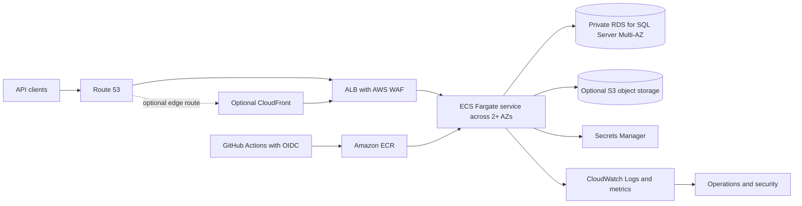

# Architecture Overview

## Status

This is the target design, not deployed infrastructure. ECS on AWS Fargate is the production default to reduce host management. EC2 Auto Scaling remains an optional learning path or justified exception. See [Decisions and Cost](07-decisions-and-cost.md).

## System view

The direct baseline associates WAF with the ALB. If CloudFront is enabled, decide where WAF is associated (CloudFront, ALB, or both), disable unsafe API caching, and restrict/test origin access so clients cannot bypass edge controls.

## Request and data flow

1. Route 53 resolves the public API hostname; clients connect using TLS.
2. Requests reach the ALB/WAF baseline. CloudFront is optional for measured edge-delivery, caching, or security requirements.
3. The ALB forwards only to healthy ECS targets. Tasks run in private application subnets across at least two AZs and have no public IPs.
4. The API connects to RDS through security-group-restricted SQL traffic; database credentials are fetched at runtime from Secrets Manager using the task role.
5. Optional object data is stored in a private S3 bucket through task IAM. EFS is not a default component.
6. Logs, metrics, audit events, and alarms go to approved operations/security destinations with defined retention and redaction.

## Release flow

```mermaid
flowchart LR
    PR[Pull request] --> Checks[Tests, IaC, dependency and image scans]
    Checks --> Main[Protected merge]
    Main --> Build[Build immutable image]
    Build --> ECR[Push to ECR by digest]
    ECR --> Stage[Deploy staging]
    Stage --> Verify[Smoke and health checks]
    Verify --> Approval[Production approval]
    Approval --> Deploy[Production deployment]
    Deploy --> Observe[Post-deploy verification]
    Observe --> Rollback[Rollback on agreed thresholds]
```

Keep application releases separate from Terraform applies. Promote the same image digest; do not rebuild a different artifact for production.

## Environments and failure boundaries

Use separate AWS accounts for production and non-production under an organization where practical. A learning deployment belongs in an isolated sandbox. Separate state, roles, secrets, DNS, and data by environment.

Multi-AZ protects against common in-region AZ/component failures; RDS Multi-AZ is not regional DR. Regional outage, account compromise, data corruption, bad releases, quota exhaustion, and operator error need separate controls and exercises. Health checks should signal readiness without causing cascading target removal during downstream outages.

## Trust boundaries

- Public client to ingress: TLS, WAF, request controls, and API authentication/authorization.
- ALB to service: only the target port and health checks.
- Service to database: restricted network path and workload identity/secret.
- CI to AWS: scoped OIDC trust, short-lived credentials, separate plan/apply permissions.
- Operators: federated access, MFA, audited role assumption; avoid routine SSH.

This reference uses synthetic data. Before real sensitive data, complete data-flow mapping, threat modeling, privacy/compliance review, retention, audit, access, key ownership, and incident-response requirements. Encryption alone does not establish compliance.
